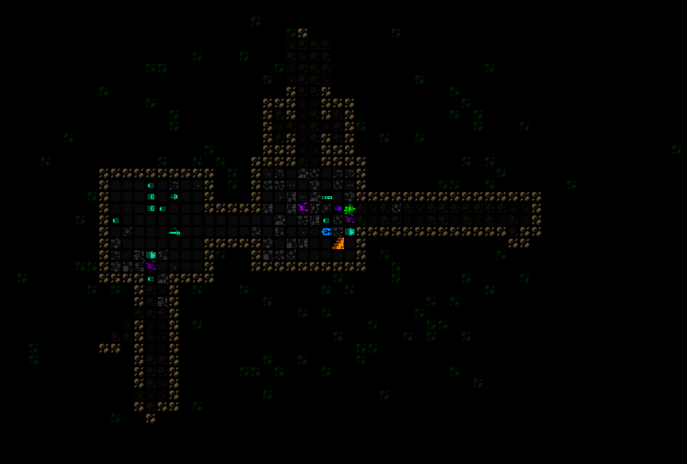

# 11 - Scrapyard

not much here, just the normal start

try to get a seismic scanner, terrain scanner, terrain processor, mid storage before leaving to [Materials](seed.FlakSchematicShockpuncher.10-Materials).

